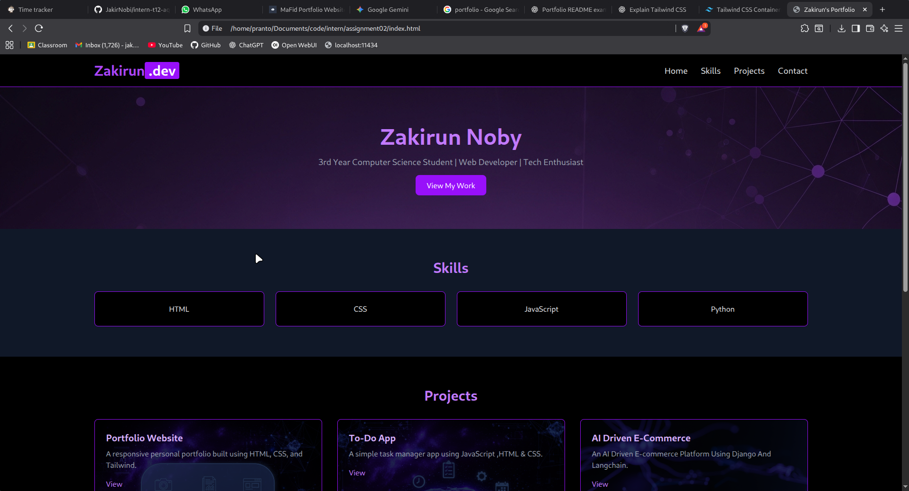

# 🌐 Zakirun's Portfolio

This is my **personal portfolio website** for showcasing skills, projects, and contact details.
It has been built using **HTML, CSS, and TailwindCSS** with a modern **purple black & gray theme**.

---

## 🚀 Features

* **Responsive Design** – Works on desktop, tablet, and mobile.
* **Hero Section** – Intro with a background image and a call-to-action button.
* **Skills Section** – Displays technical skills with hover animations.
* **Projects Section** – Showcases projects with background images and details.
* **Contact Section** – Simple form to send a message.
* **Minimal & Clean UI** – Purple black & gray theme with hover transitions.

---

## 🛠️ Tech Stack

* **HTML5**
* **CSS3**
* **[TailwindCSS](https://tailwindcss.com/)** (via CDN)

---

## 📸 Preview

### Landing Page

## 📬 Contact

Feel free to connect with me:

**Name:** Zakirun Noby
**Email:** [jakirnoby@example.com](mailto:jakirnoby@example.com)

---

© 2025 Zakirun Noby. All rights reserved.
